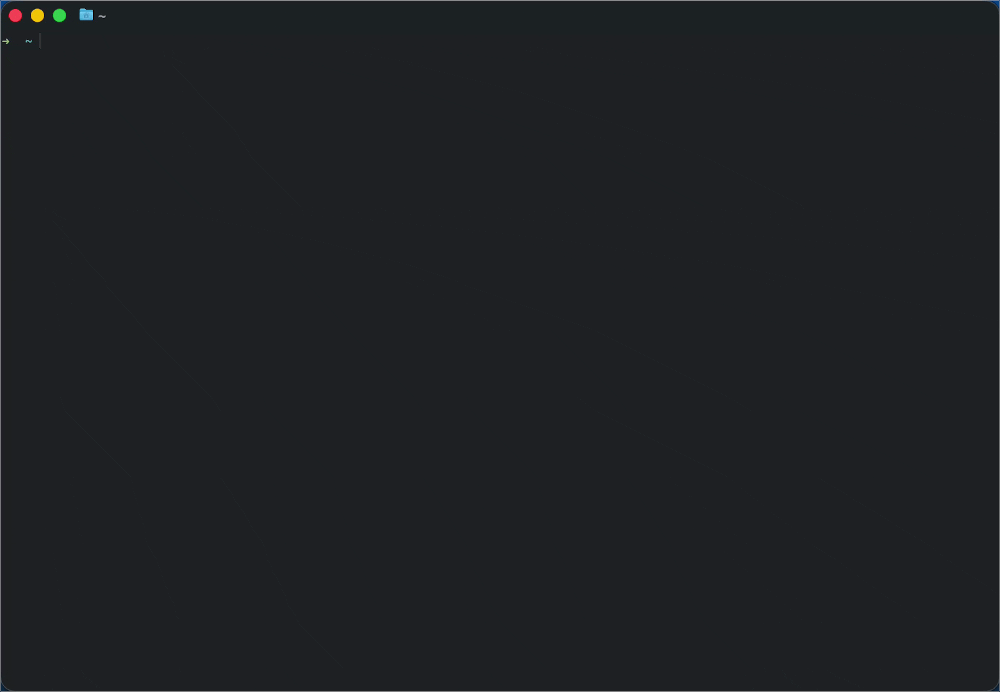

# 🖥️ orbit-tui

**A k9s-inspired Terminal UI for GraphQL Federation**




---

## 🎯 Purpose

`orbit-tui` provides an interactive terminal interface for exploring GraphQL Federation ecosystems. Navigate through profiles, projects, targets, and services with vim-style keybindings.

---

## ✨ Features

- ⌨️ **Vim Keybindings** — `j/k` navigation, `Enter` to select, `Esc` to go back
- 🧭 **Breadcrumb Navigation** — Always know where you are
- 📊 **Real-time Data** — Connects to GraphQL Hive API
- 📜 **Schema Viewer** — View subgraph SDL with scrolling
- 🔄 **Supergraph Toggle** — Switch between subgraph and composed supergraph
- 🎨 **Clean Interface** — Inspired by [k9s](https://k9scli.io/)

---

## 🚀 Quick Start

```bash
# From workspace root
cargo run -p orbit-tui

# Or build release
cargo build -p orbit-tui --release
./target/release/orbit-tui
```

**Prerequisites:** A configured profile (see below)

---

## ⚙️ Configuration

The TUI requires a profile to connect to GraphQL Hive. You can create one using the CLI or manually.

### Option 1: Using the CLI

```bash
# Add a new profile
cargo run -p orbit-cli -- profile add \
  --name my-profile \
  --token YOUR_HIVE_TOKEN \
  --endpoint https://app.graphql-hive.com/graphql \
  --org your-organization-slug

# Switch to a profile
cargo run -p orbit-cli -- profile use my-profile

# List all profiles
cargo run -p orbit-cli -- profile list

# Show current profile
cargo run -p orbit-cli -- profile show
```

### Option 2: Manual Configuration

Create the config file at `~/.config/orbit/orbit.toml` (macOS/Linux):

```toml
current_profile = "my-profile"

[profiles.my-profile]
token = "YOUR_HIVE_TOKEN"
endpoint = "https://app.graphql-hive.com/graphql"
org = "your-organization-slug"
vendor = "hive"

# You can add multiple profiles
[profiles.work]
token = "WORK_TOKEN"
endpoint = "https://app.graphql-hive.com/graphql"
org = "work-org"
vendor = "hive"
```

### Getting Your Hive Token

1. Go to [GraphQL Hive](https://app.graphql-hive.com/)
2. Navigate to your organization settings
3. Create a new token with read access

---

## ⌨️ Keybindings

| Key | Action |
|-----|--------|
| `j` / `↓` | Navigate down |
| `k` / `↑` | Navigate up |
| `Enter` | Select / Drill in |
| `Esc` | Go back |
| `Tab` | Toggle supergraph (in schema view) |
| `q` | Quit |
| `Ctrl+c` | Quit |

---

## 🗺️ Navigation Flow

```
┌─────────────────┐
│ Profile Select  │
└────────┬────────┘
         │ Enter
         ▼
┌─────────────────┐
│    Projects     │
└────────┬────────┘
         │ Enter
         ▼
┌─────────────────┐
│    Targets      │
└────────┬────────┘
         │ Enter
         ▼
┌─────────────────┐
│   Services      │
└────────┬────────┘
         │ Enter
         ▼
┌─────────────────┐
│  Schema (SDL)   │
└─────────────────┘

Press Esc at any level to go back ↑
```

---

## 🖼️ Interface Layout

### List View (Profiles, Projects, Targets, Services)
```
┌─────────────────────────────────────────────────┐
│ api-gateway > production > Services             │  ← Header (breadcrumb)
├─────────────────────────────────────────────────┤
│                                                 │
│ >> users                                        │  ← Content (list)
│    products                                     │
│    orders                                       │
│    payments                                     │
│                                                 │
├─────────────────────────────────────────────────┤
│ j/k: navigate │ Enter: select │ Esc: back       │  ← Footer (help)
└─────────────────────────────────────────────────┘
```

### Schema View
```
┌─────────────────────────────────────────────────┐
│ api-gateway > production > users > Schema       │  ← Header (breadcrumb)
├─────────────────────────────────────────────────┤
│ Subgraph Schema - Press TAB to Switch           │
│─────────────────────────────────────────────────│
│ type User {                                     │
│   id: ID!                                       │  ← Schema SDL
│   name: String!                                 │     (scrollable)
│   email: String!                                │
│ }                                               │
│                                                 │
├─────────────────────────────────────────────────┤
│ j/k: scroll │ Tab: toggle supergraph │ Esc: back│  ← Footer (context-aware)
└─────────────────────────────────────────────────┘
```

---

## 🏗️ Architecture

### The Elm Architecture (TEA)

`orbit-tui` follows the **Elm Architecture** pattern:

```
┌────────────────────────────────────────────┐
│                                            │
│  Input ──▶ Action ──▶ Update ──▶ State    │
│    ▲                              │        │
│    │                              ▼        │
│  Screen ◀─────── Render ◀────────┘        │
│                                            │
└────────────────────────────────────────────┘
```

| Component | File | Purpose |
|-----------|------|---------|
| **Action** | `action.rs` | Enum of all possible events |
| **Model** | `app.rs` | Application state (`App` struct) |
| **Update** | `app.rs` | `update()` function handles actions |
| **View** | `ui.rs` | `render()` function draws UI |
| **Input** | `input.rs` | Maps keys to actions |

### File Structure

```
orbit-tui/src/
├── main.rs       # Entry point, event loop
├── tui.rs        # Terminal init/restore, panic hook
├── action.rs     # Action enum
├── app.rs        # App struct, update logic
├── input.rs      # Key → Action mapping
├── view.rs       # ViewType enum, NavigationStack
└── ui.rs         # Rendering functions
```

---

## 📚 Dependencies

| Crate | Purpose |
|-------|---------|
| `ratatui` | TUI framework (widgets, layout) |
| `crossterm` | Terminal backend (raw mode, events) |
| `tokio` | Async runtime |
| `orbit-core` | Shared library (API client, config) |

---

## ✅ Implemented Features

- [x] Schema SDL viewer with scrolling
- [x] Toggle between subgraph/supergraph (`Tab` key)
- [x] Context-aware keybindings (scroll in schema, navigate in lists)
- [x] Breadcrumb navigation

## 🔮 Future Enhancements
- [ ] Create Profile in TUI
- [ ] Syntax highlighting for GraphQL SDL
- [ ] Search within schema (`/` key)
- [ ] Copy schema to clipboard
- [ ] Error display in UI
- [ ] Writing Operation
- [ ] Live Querying

---

## 🙏 Inspiration

- [k9s](https://k9scli.io/) — The UX, navigation pattern, and vim keybindings
- [Ratatui](https://ratatui.rs/) — Excellent documentation and examples
- [The Elm Architecture](https://guide.elm-lang.org/architecture/) — State management pattern
